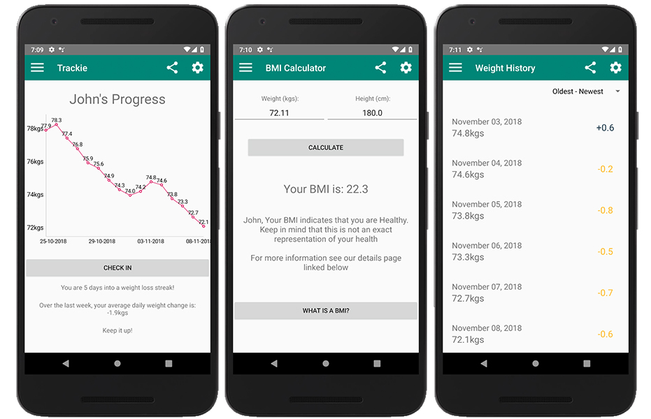

# Trackie - Jai Lafferty

## Your Friendly Weight Tracking App

Trackie is a weight tracking progress app designed to visually represent the weight of the user in their weight gain/loss journey.

### Objective

The objective of this app is to create a non-trivial app for my Software Development for Mobile Devices unit at university. The app had to implement a list of features using certain technologies available to us within the Android development ecosystem. Some of those requirements were:

- A minimum of 4-5 activities (fewer were acceptible given an application with greater complexity)
- Must make use of ActionBar/Toolbar, Fragments and demonstate a use of both global and contextual navigation in the design
- Must make use of local storage and networking.

### Features

- Save and load weight data in both Metric and Imperial
- Display this weight in an interactive graph (Thanks to [PhilJay's MPAndroidChart Library](https://github.com/PhilJay/MPAndroidChart))
- Generates statistics based on Gain/Loss streaks and average weight change over the last week
- Calculate BMI based on users' personal data
- ~~Unit converter (kg-lbs etc.)~~ Calculates daily calorie allowance to maintain weight based on BMR and activity level
- Calculates how long until weight goal achieved given calorie deficit
- All data is shareable across apps
- About page which displays this repo's readme (falls back on most recent local copy)

### How to Demo

In the settings menu you will find a button enabling sample data to be entered into the app. This will allow you to test out the app's functionality without spending multiple weeks inputting data each day.

### Sources

- [checkyourhealth.org](http://www.checkyourhealth.org/eat-healthy/cal_calculator.php)
- [healthyweight.health.gov.au](http://healthyweight.health.gov.au/wps/portal/Home/get-started/are-you-a-healthy-weight/bmi/)
- [PhilJay's MPAndroidChart Library](https://github.com/PhilJay/MPAndroidChart)